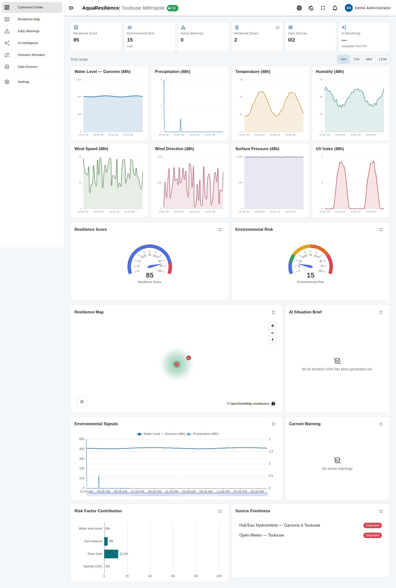
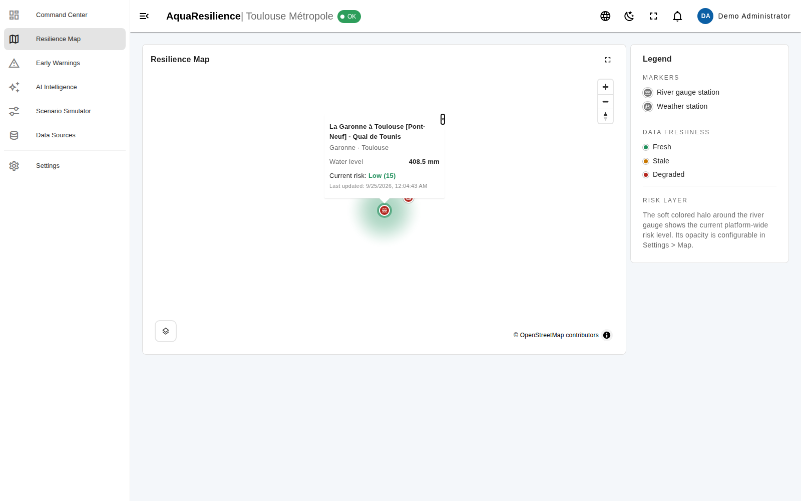
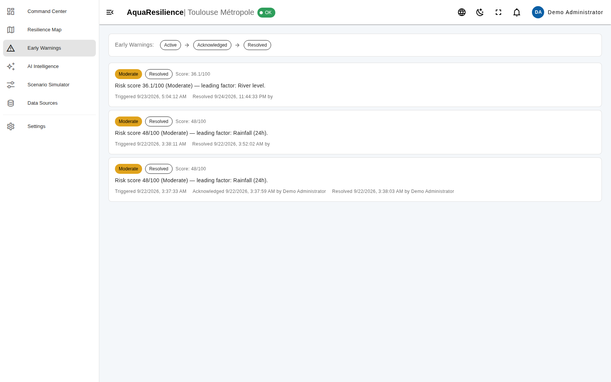
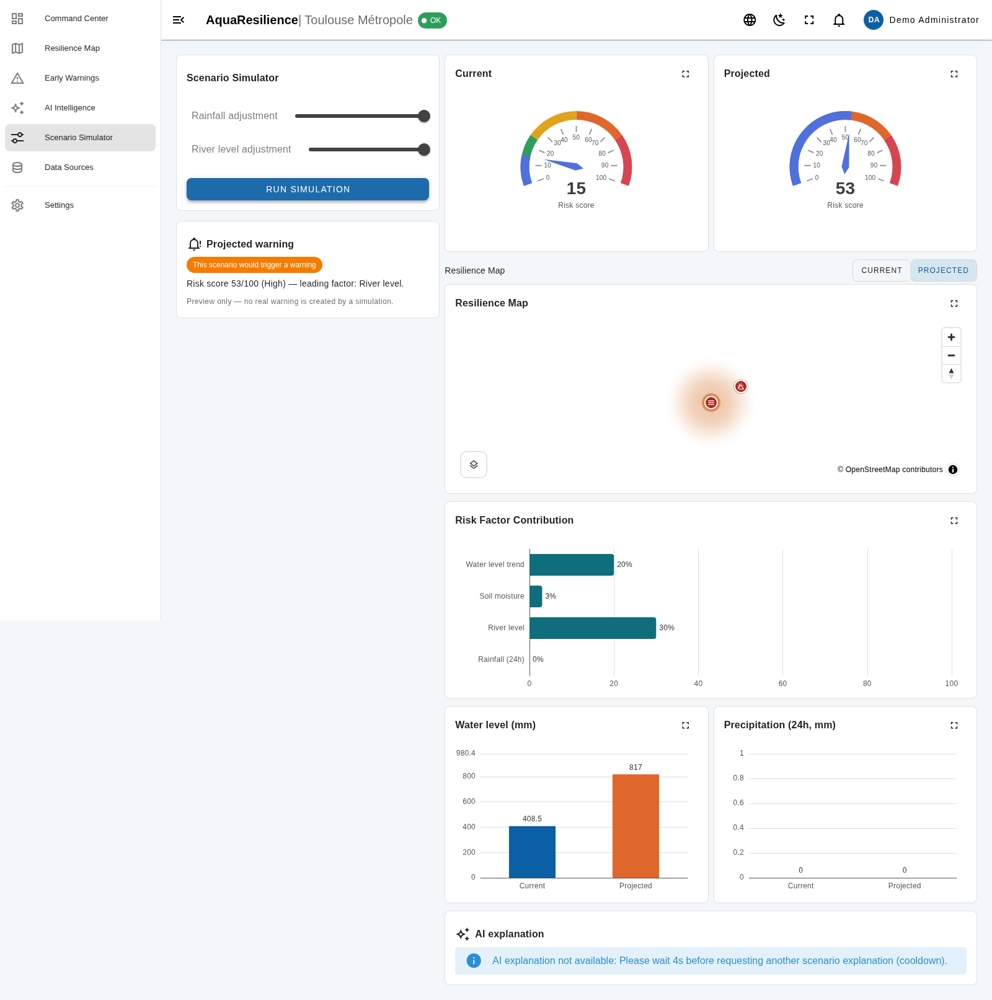

# AquaResilience

AI-assisted urban freshwater resilience intelligence platform — OneAquaHealth IEEE Global Hackathon 2026, **Track 6: Resilience Informatics** ("Enable early warning & resilience planning... predictive dashboards, alerts, and resilience tools"). Demo geography: Toulouse / Toulouse Métropole.

AquaResilience combines real environmental and hydrological data to detect emerging risk, explain its drivers, issue early warnings, brief an AI-generated situation summary, and let an operator simulate future rainfall/river scenarios on an interactive map for resilience planning — all while keeping risk calculation deterministic and explainable, with the AI strictly as an interpretive layer on top (see `docs/RESPONSIBLE_AI.md`).

## What's implemented

- **Real environmental data**: two free, key-less public sources (Hub'Eau hydrometry, Open-Meteo weather) with scheduled ingestion, idempotent storage, and fresh/stale/degraded provenance — see `docs/DATA_SOURCES.md`.
- **Command Center**: real-time KPIs, an interactive Toulouse map (hero component), an environmental signals timeline, and source-health visibility.
- **Explainable Risk Engine**: a deterministic 0–100 score from 4 configurable weighted factors (rainfall, hydrology, environmental, trend) — same inputs always give the same score, and every factor's contribution is stored so the dashboard can answer "why is risk 71/100?".
- **Early Warning**: automatic warnings on configured risk thresholds, with a simple ACTIVE → ACKNOWLEDGED → RESOLVED lifecycle, contributing factors and a recommended response.
- **AI Resilience Intelligence**: a scheduled (and now event-triggered) structured Situation Brief — summary, drivers, zones to watch, recommendations, confidence, limitations — from a configurable OpenAI/Anthropic provider, with graceful degradation if the AI is unavailable.
- **Scenario Simulator**: rainfall/river-level "what-if" controls drive a deterministic projected risk (reusing the exact same Risk Engine — never a second model), synchronizing the Risk Gauge, the map (Current/Projected toggle), the factor breakdown and the trend charts, plus an optional AI explanation.
- **Platform**: authentication, relational RBAC (with per-user permission overrides), full EN/FR/ES internationalization, light/dark theme, collapsible sidebar and monitoring fullscreen, and a production reverse-proxy/HTTPS Docker Compose stack.

Full functional history and current completion status: `AquaResilience_Development_Progress_Priority_Blocks.md` (live tracker). Architecture rationale: `docs/ARCHITECTURE.md`.

## Screenshots

| Command Center | Resilience Map |
|---|---|
|  |  |

| Early Warnings | Scenario Simulator — Current → Projected |
|---|---|
|  |  |

More in `docs/screenshots/`. *Captured in an isolated development sandbox whose network policy blocks the real Hub'Eau/Open-Meteo APIs and any AI provider outright — that's why Data Sources/AI Intelligence show a degraded/unconfigured state above (itself a real, tested feature: the platform degrades gracefully rather than breaking). On a machine with normal internet access and a configured AI provider key, Data Sources show Fresh and the AI Situation Brief is populated.*

## Stack

- **Frontend:** Vue 3 + TypeScript + Vite + Vuetify, Pinia, Vue Router, vue-i18n (EN/FR/ES), MapLibre GL JS, Apache ECharts
- **Backend:** FastAPI, Pydantic, SQLAlchemy, Alembic
- **Data:** PostgreSQL + PostGIS, Redis
- **Runtime:** Docker Compose (single command startup)

## Quick start

```bash
cp .env.example .env
# Edit .env: set SECRET_KEY, SECRETS_ENCRYPTION_KEY, POSTGRES_PASSWORD, DEMO_ADMIN_PASSWORD.
docker compose up -d
```

- Frontend: http://localhost:8080
- Backend API docs: http://localhost:8000/docs
- Health: http://localhost:8000/health/live, http://localhost:8000/health/ready

Demo login (admin-only account creation — see `.env`): `DEMO_ADMIN_EMAIL` / `DEMO_ADMIN_PASSWORD`. The demo account is seeded with the **Administrator** role so the full platform (including Settings and Users & Access) is reachable for evaluation. Seed the deterministic demo environmental dataset with `python -m app.seed.seed_environmental` (or `--reset` to rebuild it) so the Command Center and map are never empty — see `docs/DATA_SOURCES.md`.

## Repository layout

```text
backend/    FastAPI application, Alembic migrations, tests
frontend/   Vue 3 application (Vuetify UI, i18n, MapLibre, ECharts)
docs/       Architecture, data-source and responsible-AI documentation
deploy/     nginx reverse-proxy config, TLS bootstrap scripts (production)
```

## Development without Docker

Backend:

```bash
cd backend
python -m venv .venv && source .venv/bin/activate
pip install -r requirements.txt
alembic upgrade head
python -m app.seed.seed_data
python -m app.seed.seed_environmental
uvicorn app.main:app --reload
```

Frontend:

```bash
cd frontend
npm install
npm run dev
```

## Production deployment

`docker-compose.yml` above is the dev stack (hot-reload, ports exposed for
convenience). For a real deployment — reverse proxy, HTTPS, no source
bind-mounts, Postgres/Redis/backend/frontend all internal-only — see
[`DEPLOYMENT.md`](DEPLOYMENT.md) and `docker-compose.prod.yml`. It includes
a quick self-signed-HTTPS path that needs no domain at all, for local
testing or recording a demo.

## Documentation

- [`docs/ARCHITECTURE.md`](docs/ARCHITECTURE.md) — system design, key decisions, data flow.
- [`docs/DATA_SOURCES.md`](docs/DATA_SOURCES.md) — Hub'Eau and Open-Meteo: what's ingested, license, provenance.
- [`docs/RESPONSIBLE_AI.md`](docs/RESPONSIBLE_AI.md) — what the AI layer is and isn't allowed to do, and how the platform degrades gracefully without it.
- [`DEPLOYMENT.md`](DEPLOYMENT.md) — production reverse-proxy/HTTPS deployment guide.

## Security notes

- Passwords hashed with bcrypt (via passlib); JWT access/refresh tokens; login endpoint rate-limited via Redis.
- Relational RBAC (users/roles/modules/permissions) gates every backend endpoint, not just the UI.
- AI provider API keys are encrypted at rest (Fernet) and are **write-only**: the API never returns a stored secret, only a configured/not-configured status.
- PostgreSQL and Redis are never published to the host in either the dev or the production Compose stack.
- Production deployment terminates HTTPS at a dedicated reverse proxy (nginx), with Postgres/Redis/backend/frontend all internal-only — see `DEPLOYMENT.md`.
- `.env` is git-ignored; `.env.example` contains no real secrets.

## Roadmap

See `AquaResilience_Master_Spec_Priority_Blocks.md` (source of truth) and `AquaResilience_Development_Progress_Priority_Blocks.md` (live tracker) for the full functional priority block plan (P0–P5) and current completion status.
